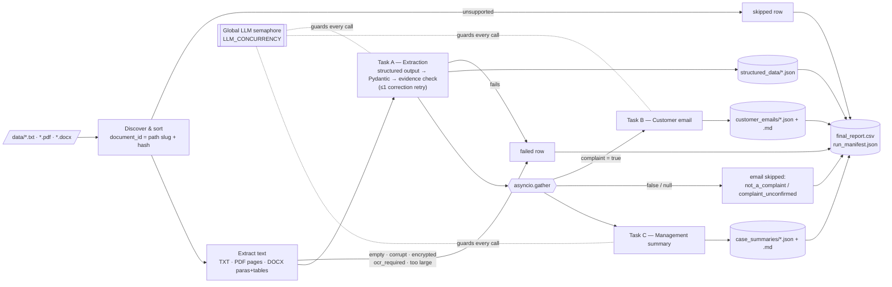

# CaseFlow AI — Architecture

## Pipeline



Documents flow through this pipeline concurrently, up to `BATCH_CONCURRENCY` at a time. Every provider request, from any document or branch, must acquire the one global `LLM_CONCURRENCY` semaphore.

## Layers

| Layer | Module | Responsibility |
|---|---|---|
| Interface | `cli.py` | Parse arguments, load config, print the run summary, return exit codes |
| Config | `config.py` | Read `.env`/environment, apply CLI overrides, validate at startup |
| Ingestion | `ingestion.py` | Discover files, build stable IDs, extract text, classify file-level errors |
| Contracts | `schemas.py` | Pydantic models; evidence, grounding and consistency checks |
| Prompts | `prompts.py` | System and task templates, untrusted-data fencing, correction note |
| Provider | `llm_client.py` | `LLMProvider` protocol, `OpenAIProvider` (Responses API + Structured Outputs), `MockProvider`, error taxonomy, `LLMLimiter` |
| Tasks | `tasks.py` | Tasks A, B and C; bounded transport retries; one correction retry; email decision |
| Orchestration | `workflow.py` | Per-document dependency flow, parallel B/C, isolation, statuses, manifest and report rows |
| Output | `output_writer.py` | Run folders, atomic writes, Markdown rendering, safe CSV |
| Observability | `logging_config.py` | Console and per-run file logs, redaction filter |

The workflow depends only on `LLMProvider.generate(request) -> dict`. SDK response objects never leave `llm_client.py`, so the mock, the test fake and OpenAI can be swapped freely.

## Requirement → implementation → test

| Requirement | Implementation | Tests |
|---|---|---|
| TXT/PDF/DOCX text extraction, DOCX tables, all PDF pages | `ingestion.extract_text`, `_docx_blocks` | `test_ingestion.py::test_txt_with_bom`, `test_pdf_all_pages_extracted`, `test_docx_paragraphs_and_tables_in_order` |
| Case-insensitive, sorted, non-recursive by default, `--recursive` | `ingestion.discover_documents`, `cli --recursive` | `test_discovery_sorted_case_insensitive_nonrecursive_by_default` |
| Empty, corrupt, encrypted, encoding, OCR-required, oversized: file-level failures | `IngestionError` codes | `test_file_level_failures`, `test_scanned_pdf_requires_ocr`, `test_encrypted_pdf`, `test_oversized_file_and_text_are_not_truncated`, `test_txt_invalid_utf8_reports_encoding_error` |
| Unsupported files skipped, never sent to the LLM | `unsupported_format` → `skipped` | `test_unsupported_file_is_skipped_not_read`, `test_mock_demo_end_to_end` |
| Stable, collision-free document IDs | `make_document_id` | `test_identical_stems_get_distinct_ids` |
| Strict schema with `extra='forbid'`, nullable unknowns | `schemas.CaseExtraction` etc. | `test_extra_keys_forbidden`, `test_missing_fields_stay_unknown`, `test_malformed_types_rejected` |
| Evidence required and verbatim in source | model validator + `check_evidence` | `test_populated_fields_require_evidence`, `test_invented_evidence_quote_fails`, `test_evidence_matching_normalises_whitespace_case_and_quotes` |
| Yes/No/Unknown CSV mapping | `schemas.bool_to_report` | `test_missing_fields_stay_unknown`, `test_email_skipped_and_review_flagged_for_unconfirmed_complaint` |
| Real schema-constrained output | `OpenAIProvider.generate` → `responses.parse(text_format=...)` (strict JSON schema) | `test_openai_provider.py::test_structured_output_request_and_parse` |
| No unvalidated data saved; one correction retry | `tasks.run_structured_task` | `test_one_correction_retry_fixes_invented_quote`, `test_malformed_output_never_accepted_after_correction`, `test_provider_output_error_uses_correction_slot` |
| No invented amounts, references or contacts in B and C | `check_grounded_facts` | `test_grounding_flags_invented_amounts_and_references` |
| Task A before B and C; B and C concurrent | `workflow._process` + `asyncio.gather` | `test_extraction_completes_before_downstream_tasks` |
| Independent downstream failure → `partial_success` | `_email_branch` / `_summary_branch` catch their own errors | `test_downstream_failure_keeps_other_artifacts` |
| Extraction failure skips B and C | `extraction_failed` skip reason | `test_extraction_failure_skips_downstream` |
| Email skipped for non-complaint / unconfirmed | `tasks.email_decision` | `test_email_skipped_for_noncomplaint`, `test_email_skipped_and_review_flagged_for_unconfirmed_complaint` |
| Batch continues after a bad file | per-document isolation in `run_batch.worker` | `test_batch_continues_after_corrupt_file`, `test_failure_demo_exit_code` |
| Global API concurrency cap | `LLMLimiter` shared by all tasks | `test_global_llm_concurrency_limit_respected` |
| Bounded retries, backoff, jitter, Retry-After, semaphore not held while sleeping | `tasks._call_with_retries`, `backoff_delay` | `test_transient_errors_are_retried_then_succeed`, `test_retries_are_bounded`, `test_backoff_grows_and_is_capped`, `test_hung_request_times_out_and_is_bounded` |
| Non-retryable and fatal errors, SDK retries disabled | `ProviderError(fatal=...)`, `AsyncOpenAI(max_retries=0)` | `test_nonretryable_error_is_not_retried`, `test_401_is_fatal_and_not_retried`, `test_fatal_provider_error_aborts_remaining_documents`, `test_insufficient_quota_is_fatal` |
| Atomic writes, per-run folder, no overwrite | `atomic_write_text`, `create_run_dir` | `test_atomic_write_replaces_and_leaves_no_temp`, `test_run_dir_never_reused`, `test_outputs_saved_are_schema_valid_and_isolated_per_run` |
| CSV via `csv` module, formula-injection protection | `render_report_csv`, `escape_csv_cell` | `test_formula_injection_escaped`, `test_csv_quotes_commas_newlines_and_quotes` |
| Graceful interruption | `run_batch` `finally` + CLI exit code 130 | `test_interruption_preserves_completed_outputs_and_manifest` |
| No personal data or keys in logs | `sanitize`, `RedactingFilter` | `test_mock_demo_end_to_end` (checks the log file), `test_nonretryable_error_is_not_retried` |
| Startup validation, exit codes | `config.validate_settings`, `cli.exit_code_for` | `test_real_mode_without_key_is_fatal_startup_error`, `test_missing_input_folder_is_fatal` |
| Mock clearly labelled; fails on unknown documents | `MockProvider`, manifest `is_mock`, Markdown banner | `test_mock_demo_end_to_end`, failure demo (`unknown_to_mock.txt`) |
| Opt-in real-provider smoke test | — | `test_real_provider_smoke.py` (skipped by default) |

## Retry budget per task call

```
for correction in (no, yes):                      # ≤ 2 rounds
    for attempt in 1 .. MAX_RETRIES + 1:          # transport retries
        async with LLM semaphore: call provider   # held only during the call
        on transient error: sleep(backoff)        # semaphore released
    validate (Pydantic + evidence/grounding)
    if valid: return
fail with validation_failed
```

Worst case per task: `2 × (MAX_RETRIES + 1)` calls. Fatal errors (401, 403, 404, no quota) stop immediately and abort the run.
